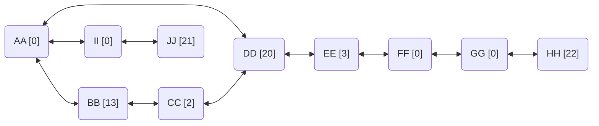

https://adventofcode.com/2022/day/16

グラフ、そして突然の象。


## part1

```
Valve AA has flow rate=0; tunnels lead to valves DD, II, BB
Valve BB has flow rate=13; tunnels lead to valves CC, AA
Valve CC has flow rate=2; tunnels lead to valves DD, BB
Valve DD has flow rate=20; tunnels lead to valves CC, AA, EE
Valve EE has flow rate=3; tunnels lead to valves FF, DD
Valve FF has flow rate=0; tunnels lead to valves EE, GG
Valve GG has flow rate=0; tunnels lead to valves FF, HH
Valve HH has flow rate=22; tunnel leads to valve GG
Valve II has flow rate=0; tunnels lead to valves AA, JJ
Valve JJ has flow rate=21; tunnel leads to valve II
```

のような入力が与えられます。

洞窟内の各部屋にバルブがあり、それぞれの部屋同士がトンネルで繋がりネットワークを形成しています。バルブにはそれぞれ流量(1分ごとに開放される圧力)が設定されていて、それを開けるのに1分、またはトンネルを通ってバルブ間を移動するのにも1分かかるとします。
`AA` のバルブからスタートし、 **30分** の間で開放できる圧力総量は最大でいくらになるでしょうか、という問題です。
上述の例で表されるネットワークは以下のようになります。



例えば、最初の位置の `AA` は流量が `0` なので開ける意味がありません。もし1分かけて `BB` のバルブに移動し 1分かけてそれを開けると、残りの28分間は流量 `13` で圧力が開放され続け、総量として `28 * 13 = 364` が得られます。さらにそこから1分かけて `CC` に移動し 1分かけてそれを開けると、流量 `2` で残りの26分間圧力が開放され続けるので最終的な総量は `52` 増加します。

実際にこの例で最大の総量を得るためには、以下のような手順で移動と開放を行います。

```
== Minute 1 ==
No valves are open.
You move to valve DD.

== Minute 2 ==
No valves are open.
You open valve DD.

== Minute 3 ==
Valve DD is open, releasing 20 pressure.
You move to valve CC.

== Minute 4 ==
Valve DD is open, releasing 20 pressure.
You move to valve BB.

== Minute 5 ==
Valve DD is open, releasing 20 pressure.
You open valve BB.

== Minute 6 ==
Valves BB and DD are open, releasing 33 pressure.
You move to valve AA.

== Minute 7 ==
Valves BB and DD are open, releasing 33 pressure.
You move to valve II.

== Minute 8 ==
Valves BB and DD are open, releasing 33 pressure.
You move to valve JJ.

== Minute 9 ==
Valves BB and DD are open, releasing 33 pressure.
You open valve JJ.

== Minute 10 ==
Valves BB, DD, and JJ are open, releasing 54 pressure.
You move to valve II.

== Minute 11 ==
Valves BB, DD, and JJ are open, releasing 54 pressure.
You move to valve AA.

== Minute 12 ==
Valves BB, DD, and JJ are open, releasing 54 pressure.
You move to valve DD.

== Minute 13 ==
Valves BB, DD, and JJ are open, releasing 54 pressure.
You move to valve EE.

== Minute 14 ==
Valves BB, DD, and JJ are open, releasing 54 pressure.
You move to valve FF.

== Minute 15 ==
Valves BB, DD, and JJ are open, releasing 54 pressure.
You move to valve GG.

== Minute 16 ==
Valves BB, DD, and JJ are open, releasing 54 pressure.
You move to valve HH.

== Minute 17 ==
Valves BB, DD, and JJ are open, releasing 54 pressure.
You open valve HH.

== Minute 18 ==
Valves BB, DD, HH, and JJ are open, releasing 76 pressure.
You move to valve GG.

== Minute 19 ==
Valves BB, DD, HH, and JJ are open, releasing 76 pressure.
You move to valve FF.

== Minute 20 ==
Valves BB, DD, HH, and JJ are open, releasing 76 pressure.
You move to valve EE.

== Minute 21 ==
Valves BB, DD, HH, and JJ are open, releasing 76 pressure.
You open valve EE.

== Minute 22 ==
Valves BB, DD, EE, HH, and JJ are open, releasing 79 pressure.
You move to valve DD.

== Minute 23 ==
Valves BB, DD, EE, HH, and JJ are open, releasing 79 pressure.
You move to valve CC.

== Minute 24 ==
Valves BB, DD, EE, HH, and JJ are open, releasing 79 pressure.
You open valve CC.

== Minute 25 ==
Valves BB, CC, DD, EE, HH, and JJ are open, releasing 81 pressure.

== Minute 26 ==
Valves BB, CC, DD, EE, HH, and JJ are open, releasing 81 pressure.

== Minute 27 ==
Valves BB, CC, DD, EE, HH, and JJ are open, releasing 81 pressure.

== Minute 28 ==
Valves BB, CC, DD, EE, HH, and JJ are open, releasing 81 pressure.

== Minute 29 ==
Valves BB, CC, DD, EE, HH, and JJ are open, releasing 81 pressure.

== Minute 30 ==
Valves BB, CC, DD, EE, HH, and JJ are open, releasing 81 pressure.
```

これによって30分間で得られる開放圧力総量の **`1651`** が解となります。

### 考え方

各時間で「バルブの開放」もしくは「隣のバルブに移動」の選択肢があり、仮にそれらがすべて二択だったとしても $2^{30}$ 通りの手順を調べることになり、計算量が非常に多くなってしまいます。
計算量を減らすために出来ることを考えてみます。

- 流量 `0` のバルブは開ける意味がないので、必ず素通りする
- 行ったり来たりなど、無意味なバルブ間移動はしない

つまり総量を最大化するためには、未開放の(流量が `0` でない)バルブどれかを目指して最短で移動しそれを開け、また次の未開放バルブに移動する、という行動を繰り返していくことになります。
前述の例でいうと、流量が `0` でない `BB`, `CC`, `DD`, `EE`, `HH`, `JJ` の6つのバルブだけを考え、それぞれの間を常に最短経路で移動するという前提で「どの順番で訪れ開放するのが最善か」を探すことになります。それ以外のバルブたちはもはや経路として使われるだけなので考慮の必要がありません。

そう考えると、この例では6つのバルブの開放順をすべて列挙して調べるだけになり、$6!$ でたったの `720` 通りになります。
ただ、実際の入力では流量が `0` でないバルブは15個ほどあり、それらをすべて調べるのは $15!$ で `1307674368000` 通りとなってしまい、やはり無理があります。

ここで、制限時間が30分であることを利用します。常に最短経路を通って移動していたとしても、順序によっては30分間の制限時間内にすべてを開放できないことがあります。実際、移動に1分・バルブ開放に1分かかることを考えると、30分間で15個すべての有効なバルブを開けられるのはそれらがすべて隣接しているときだけであり、おそらくそのような入力になっていることは無いと思います。
次のバルブへの移動が制限時間をオーバーしてしまう場合はその先の探索を打ち切る、といった処理を入れることで計算量を大幅に削減することができます。私の入力では、最終的に探索された経路は 18万通り程度となり、十分に高速に計算できました。
また、DFS(depth-first search, 深さ優先探索)で途中までの結果を計算し保持しながら探索していくことで効率的に総量を計算することができます。


## part2

条件は part1 と同様ですが、今度は象に手伝ってもらうことにしました。4分間を象への説明に費やし、残りの **26分間** で手分けして別々にバルブを開放していく行動をとると、開放できる圧力総量は最大でいくらになるでしょうか、という問題です。
前述の例では、以下のように象と別々に動くことで最大化することができます。

```
== Minute 1 ==
No valves are open.
You move to valve II.
The elephant moves to valve DD.

== Minute 2 ==
No valves are open.
You move to valve JJ.
The elephant opens valve DD.

== Minute 3 ==
Valve DD is open, releasing 20 pressure.
You open valve JJ.
The elephant moves to valve EE.

== Minute 4 ==
Valves DD and JJ are open, releasing 41 pressure.
You move to valve II.
The elephant moves to valve FF.

== Minute 5 ==
Valves DD and JJ are open, releasing 41 pressure.
You move to valve AA.
The elephant moves to valve GG.

== Minute 6 ==
Valves DD and JJ are open, releasing 41 pressure.
You move to valve BB.
The elephant moves to valve HH.

== Minute 7 ==
Valves DD and JJ are open, releasing 41 pressure.
You open valve BB.
The elephant opens valve HH.

== Minute 8 ==
Valves BB, DD, HH, and JJ are open, releasing 76 pressure.
You move to valve CC.
The elephant moves to valve GG.

== Minute 9 ==
Valves BB, DD, HH, and JJ are open, releasing 76 pressure.
You open valve CC.
The elephant moves to valve FF.

== Minute 10 ==
Valves BB, CC, DD, HH, and JJ are open, releasing 78 pressure.
The elephant moves to valve EE.

== Minute 11 ==
Valves BB, CC, DD, HH, and JJ are open, releasing 78 pressure.
The elephant opens valve EE.

(At this point, all valves are open.)

== Minute 12 ==
Valves BB, CC, DD, EE, HH, and JJ are open, releasing 81 pressure.

...

== Minute 20 ==
Valves BB, CC, DD, EE, HH, and JJ are open, releasing 81 pressure.

...

== Minute 26 ==
Valves BB, CC, DD, EE, HH, and JJ are open, releasing 81 pressure.
```

これによって26分間で得られる開放圧力総量の **`1707`** が解となります。

### 考え方

制限時間は part1 より短くなりますが、2人が同時に動くことができるので探索のパターンが爆発的に増えてしまいそうです。
単純化するために「人(あなた)」と「象」が同時に動くことを考えず、「それぞれ独立で開放順を選んで開放圧力総量を得たときに、開放したバルブが重複していない組み合わせでの合計値」を考えると良いでしょう。
前述の例でみると、26分間の中で

- 人は `JJ -> BB -> CC` の順で開放し、合計で `764`
- 象は `DD -> HH -> EE` の順で開放し、合計で `943`

の総量を得ていて、その合計として `1707` になる、と考えることができます。これは象と人の役割が逆でも同じ結果になります。
このように、**開放したバルブが重複しなければ** それぞれ独立した26分間での行動によって得る総量の合計値で最終的な総量を計算することができます。
従って、

1. 26分間でのすべての可能な開放順と、その結果の総量を求める
2. それらの中から、開放したバルブが重複しない組み合わせで2つを選ぶ
3. そのペアのそれぞれの総量の合計値の最大値を求める

といった手順で解を求めることができそうです。

制限時間が26分と短くなったことによって、開放できる手順は part1 よりも減っています。実際の私の入力では4万通り程度でした。注意点として、part1 は単独での最大化だけを考えましたが、part2 では全パターンを考慮するため「まだ時間が余っていて他のバルブを開けに行くことができる状態でも、そこで行動を終了する」という選択肢も考慮する必要があります。

しかし、こうして得られる約4万通りの中から重複しない組み合わせを探そうとすると約16億通りの組み合わせを調べる必要があり、まだ計算量が少し大きいです。
ここで今度は、「開放バルブが重複しないペアを探す過程においては開放の **順番を考慮する必要は無い** 」ということに注目してみます。
例えば、上の例では `JJ -> BB -> CC` の順で `764` の総量を得ていましたが、 `BB -> CC -> JJ` などの順で開放していても結果として開放されるバルブの集合としては同じです。ただ結果として、この `BB`, `CC`, `JJ` の3つを開放する場合は、 `JJ -> BB -> CC` の順で開放するのが最大の総量を得られるため、これを使うのが最善となります。
つまり上記の `1.` の過程で列挙された開放順の中から、結果として開放したバルブの集合をキーとしてまとめて、その中で最大の総量を得たものだけを考慮すれば良い、ということになります。

こうして同じ集合ごとにまとめることで、最大で $2^{15}$ の `32768` 通り 、実際の入力では可能な経路が限られるため 4000 通り程度まで減りました。ここから重複しないペアを探すのは $16 \times 10^6$ 通り程度なので十分に計算可能です。
さらに高速に最大の合計値を求める方法として、結果総量の降順でソートしておき、暫定の最大値を保持しながらもうそれを超えないことが確定した時点で打ち切る、といった工夫ができます。


## 実装例

### Python

```python
import re
import sys
from collections import defaultdict
from dataclasses import dataclass
from typing import Generator, TextIO

RE_INPUT = re.compile(
    r"Valve (\S+) has flow rate=(\d+); tunnels? leads? to valves? (.+)"
)


@dataclass
class Valve:
    label: str
    flow_rate: int
    tunnels: list[str]


class Solution:
    def __init__(self, io: TextIO) -> None:
        valves = [
            Valve(
                label=m.group(1),
                flow_rate=int(m.group(2)),
                tunnels=m.group(3).split(", "),
            )
            for m in RE_INPUT.finditer(io.read())
        ]
        names = [v.label for v in valves]
        # Floyd–Warshall algorithm によって各バルブ間の最短距離を求める
        # https://en.wikipedia.org/wiki/Floyd%E2%80%93Warshall_algorithm
        dists = {n: {n: len(valves) for n in names} for n in names}
        for v in valves:
            dists[v.label][v.label] = 0
            for t in v.tunnels:
                dists[v.label][t] = 1
        for k in names:
            for i in names:
                for j in names:
                    dists[i][j] = min(dists[i][j], dists[i][k] + dists[k][j])
        self.rates = {v.label: v.flow_rate for v in valves if v.flow_rate > 0}
        self.dists = dists

    def part1(self) -> int:
        return max(total for total, _ in self.totals("AA", frozenset(), 30, 0))

    def part2(self) -> int:
        max_totals: dict[frozenset[str], int] = defaultdict(int)
        for total, opened in self.totals("AA", frozenset(), 26, 0):
            max_totals[opened] = max(max_totals[opened], total)
        items = sorted(((v, k) for k, v in max_totals.items()), reverse=True)
        best = 0
        for t0, o0 in items:
            if t0 * 2 < best:
                break
            for t1, o1 in items:
                if not o0 & o1:
                    best = max(best, t0 + t1)
        return best

    def totals(
        self, src: str, opened: frozenset[str], minutes: int, total: int
    ) -> Generator[tuple[int, frozenset[str]], None, None]:
        """可能な開放順によって得られる総量と開放したバルブの集合を列挙する"""
        for dst in self.rates.keys() - opened:
            if (remain := minutes - self.dists[src][dst] - 1) > 0:
                yield from self.totals(
                    dst, opened | {dst}, remain, total + self.rates[dst] * remain
                )
        yield total, opened


if __name__ == "__main__":
    solution = Solution(sys.stdin)
    print(f"Part 1: {solution.part1()}")
    print(f"Part 2: {solution.part2()}")
```

`__init__()` 内で入力をparseした後、各バルブ間の最短距離を求めてしまいます。ここでは Floyd–Warshall Algorithm (ワーシャル–フロイド法) を用いています。

https://ja.wikipedia.org/wiki/%E3%83%AF%E3%83%BC%E3%82%B7%E3%83%A3%E3%83%AB%E2%80%93%E3%83%95%E3%83%AD%E3%82%A4%E3%83%89%E6%B3%95

そして、開放対象となる(`flow_rate > 0` である)バルブを抽出しておけば準備完了です。
`totals` 関数はジェネレータで、再帰的に「`src` の位置から残り `minutes` で、まだ `opened` になっていないバルブに移動した場合、もしくは現時点までの開放によって得られる総量」を列挙しています。 `yield from` で再帰呼び出しの結果をそのまま返すことができます。
あとで `dict` のキーとして使うため、 `opened` は `frozenset` で使用しています。

part1 は、 `30` 分間での最大値を単純に求めるだけです。
part2 は、まず `26` 分間でのすべての総量とバルブ集合を列挙し、同じ集合であるものはまとめて総量の最大値だけを保持します。総量の大きい順にソートし、 `best` を更新しながら、 `o0` と `o1` が重複しない組み合わせの中での最大値を探していきます。`t0` がそれまでに見つかった `best` の半分以下の場合はその先どの組み合わせでも `best` より大きくなることはないので、そこで探索を打ち切ることで高速化しています。

### Rust

```rust
use itertools::Itertools;
use std::cmp::{Ordering, Reverse};
use std::collections::HashMap;
use std::io::{BufRead, BufReader, Read};
use std::ops::{BitAnd, Not};
use std::str::FromStr;

struct Valve {
    label: String,
    flow_rate: u32,
    tunnels: Vec<String>,
}

impl FromStr for Valve {
    type Err = ();

    fn from_str(s: &str) -> Result<Self, Self::Err> {
        s.split_once("; ")
            .map(|(v, t)| Self {
                label: v[6..8].to_string(),
                flow_rate: v[23..].parse().unwrap(),
                tunnels: t
                    .splitn(5, ' ')
                    .nth(4)
                    .map(|s| s.split(", ").map(String::from).collect())
                    .unwrap_or_default(),
            })
            .ok_or(())
    }
}

#[derive(Clone, Copy)]
struct BitSet(u32);

impl Iterator for BitSet {
    type Item = usize;

    fn next(&mut self) -> Option<Self::Item> {
        if self.0 != 0 {
            let ret = self.0.trailing_zeros() as usize;
            self.0 &= self.0 - 1;
            Some(ret)
        } else {
            None
        }
    }
}

impl BitAnd for BitSet {
    type Output = Self;

    fn bitand(self, rhs: Self) -> Self::Output {
        Self(self.0 & rhs.0)
    }
}

impl Not for BitSet {
    type Output = Self;

    fn not(self) -> Self::Output {
        Self(!self.0)
    }
}

struct Solution {
    valves: Vec<Valve>,
    dists: Vec<Vec<u32>>,
    flows: BitSet,
}

impl Solution {
    fn new(r: impl Read) -> Self {
        let valves = BufReader::new(r)
            .lines()
            .filter_map(Result::ok)
            .filter_map(|line| line.parse::<Valve>().ok())
            .sorted_unstable_by(|va, vb| match vb.flow_rate.cmp(&va.flow_rate) {
                Ordering::Equal => va.label.cmp(&vb.label),
                ord => ord,
            })
            .collect_vec();
        let label2index = valves
            .iter()
            .enumerate()
            .map(|(i, valve)| (valve.label.clone(), i))
            .collect::<HashMap<_, _>>();
        let mut dists = vec![vec![u32::MAX; valves.len()]; valves.len()];
        for (i, valve) in valves.iter().enumerate() {
            dists[i][i] = 0;
            for t in &valve.tunnels {
                if let Some(&j) = label2index.get(t) {
                    dists[i][j] = 1;
                }
            }
        }
        for k in 0..valves.len() {
            for i in 0..valves.len() {
                for j in 0..valves.len() {
                    dists[i][j] = dists[i][j].min(dists[i][k].saturating_add(dists[k][j]));
                }
            }
        }
        let flows = BitSet(valves.iter().enumerate().fold(0, |acc, (i, valve)| {
            acc | (u32::from(valve.flow_rate > 0) << i)
        }));
        Self {
            valves,
            dists,
            flows,
        }
    }
    fn part1(&self) -> u32 {
        *self.max_totals(30).iter().max().unwrap()
    }
    fn part2(&self) -> u32 {
        let v = self
            .max_totals(26)
            .into_iter()
            .enumerate()
            .filter(|&(_, t)| t > 0)
            .sorted_by_cached_key(|&(_, t)| Reverse(t))
            .collect_vec();
        let mut best = v[0].1;
        for &(i0, t0) in &v {
            if t0 * 2 < best {
                break;
            }
            for &(i1, t1) in &v {
                if i0 & i1 == 0 {
                    best = best.max(t0 + t1);
                }
            }
        }
        best
    }
    fn max_totals(&self, minutes: u32) -> Vec<u32> {
        let ones = self.flows.0.count_ones() as usize;
        let mut totals = vec![0; 1 << ones];
        self.search(ones, BitSet(0), minutes, 0, &mut totals);
        totals
    }
    fn search(&self, i: usize, opened: BitSet, minutes: u32, total: u32, totals: &mut Vec<u32>) {
        if let Some(max) = totals.get_mut(opened.0 as usize) {
            *max = total.max(*max)
        }
        for j in self.flows & !opened {
            let remain = minutes.saturating_sub(self.dists[i][j] + 1);
            if remain > 0 {
                self.search(
                    j,
                    BitSet(opened.0 | (1 << j)),
                    remain,
                    total + self.valves[j].flow_rate * remain,
                    totals,
                );
            }
        }
    }
}

fn main() {
    let solution = Solution::new(std::io::stdin().lock());
    println!("Part 1: {}", solution.part1());
    println!("Part 2: {}", solution.part2());
}
```

基本的な方針はPython実装と同様です。より効率的に処理するために、バルブの文字列の集合を `HashSet` などで管理せずにビット演算で代用しています。
まず、parseした入力で得られたバルブ情報を「`flow_rate` 降順、 `label` 昇順」でソートします。そうすることで、 `flow_rate > 0` であるバルブの数を $n$ とすると 最初の $n$ 個だけに `opened` の集合を限定することができます。また `AA` が $n+1$ 番目の位置に来るので探索の開始場所が決まります。
各バルブ間の最短距離は同様にFloyd–Warshall Algorithmで求めます。

`search` メソッドが再帰的に探索するものになります。PythonのようにGeneratorでは実装できないので、結果の最大値を `&mut Vec<u32>` に格納していくことにします。この `Vec` のサイズは上述の $n$ から $2^n$ で収まります。
あとは `self.flows` の集合から `opened` に含まれないものを列挙して再帰的に探索していきます。ビット集合の列挙のために `BitSet` という `Iterator` を実装したものを用意しました。Bitboardなどで使われているテクニックで、 `1` であるビットの最下位の位置は `trailing_zeros()` で求められます。その後、 `n &= n - 1` という操作でそのビットを消去することができます。これを `0` になるまで繰り返すことで `1` であるビットの位置を列挙することができ、32回や64回のループで1ビットずつ確認するよりも効率的です。

これらの工夫により、私の環境では part2 も 1〜2ms程度で解を求めることができました。
